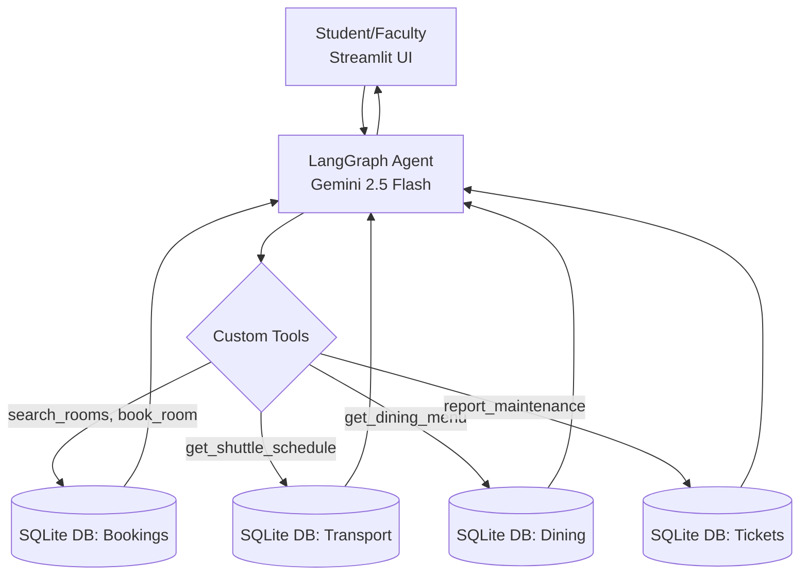

# 🎓 Project 8: Smart Campus Operations Agent

## 🎯 Problem Statement
Managing a university campus (like UAEU or AUS) requires coordinating room bookings, checking dining menus, tracking shuttle buses, and reporting facility maintenance. Doing this across multiple disconnected systems creates delays for students and staff.

## 🏗️ Architecture
This system utilizes a **LangGraph-powered ReAct Agent** that acts as the central brain, orchestrating multiple systems via Tool Calling.



## 🚀 Key Features
- **Autonomous Reasoning**: The agent determines *which* tools to use based on the query. (e.g., If asked to book a room, it first searches for available rooms, parses the IDs, then executes the booking tool).
- **Real UAEU Data**: Includes real locations from the United Arab Emirates University (CIT Building E1, Crescent Building, Student Hostels, etc.).
- **Live System Dashboard**: The UI instantly reflects new database changes (like booked rooms or generated maintenance tickets) without needing to refresh the page.
- **SQLite Database**: A completely self-contained setup mimicking complex enterprise systems.

## 🛠️ Tech Stack
- **Agent Framework**: LangGraph (`langgraph.prebuilt.create_react_agent`)
- **LLM**: Gemini 2.5 Flash
- **Database**: SQLite (via SQLAlchemy ORM)
- **UI Framework**: Streamlit
- **API Simulation**: Direct Python tool wrappers acting as microservices

## ⚙️ Setup & Run

### 1. Environment Configuration
Create a `.env` file from the provided template and add your Gemini API Key:
```env
GEMINI_API_KEY=your_key
```

### 2. Install Dependencies
```bash
pip install -r requirements.txt
```

### 3. Initialize the Database
This populates the database with real UAEU campus data.
```bash
python scripts/setup_db.py
```

### 4. Launch the Bot
```bash
streamlit run app.py
```

---
*Built for the UAE AI Student Projects Portfolio — Engineering the campuses of tomorrow.*
